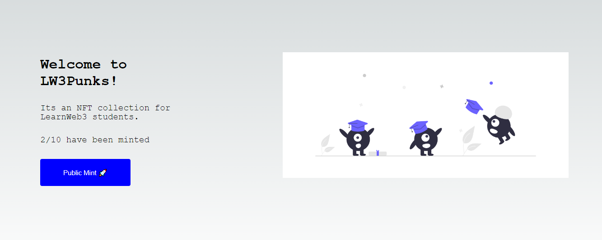

<h1 aling="center">Frontend of my NFT Collection with metadata stored on IPFS</h1>

  <a href="https://github.com/gab0071" target="_blank">
    
  </a>
 

  <br>
  <br>



Making the frontend part of my project NFT collection with metadata stored on IPFS smart contract!

<hr>
<h2> Installing / Getting started </h2>

```bash
# Clone this project
$ git clone https://github.com/gab0071/IPFS-FRONT

# Access
$ cd IPFS-FRONT

# Install dependencies
$ npm install

``` 

<h2>Commands</h2>

- $ ``` npx create-next-app@latest```
- $ ```npm run dev ``` 
<strong>Now go to `http://localhost:3000`, your app should be running </strong>🤘

Open up a terminal pointing at `my-app directory` and execute this command:
- $ ``` npm install web3modal ethers```

Note🚨 ➡ to interact with your smart contract in the folder `constants/index.js` write:

 ```js
export const NFT_CONTRACT_ADDRESS = "address of your NFT contract";
export const abi = "---your abi---";
```

<h2> Technologies / Built With </h2>

- Next.js
- Ethers.js
- Web3Modal
<hr>
Hope you enjoy making this.
<br>
<br>

<p align="center">
<br/>
  Made with ❤️ by <b>catellaTech</b>.
</p>
